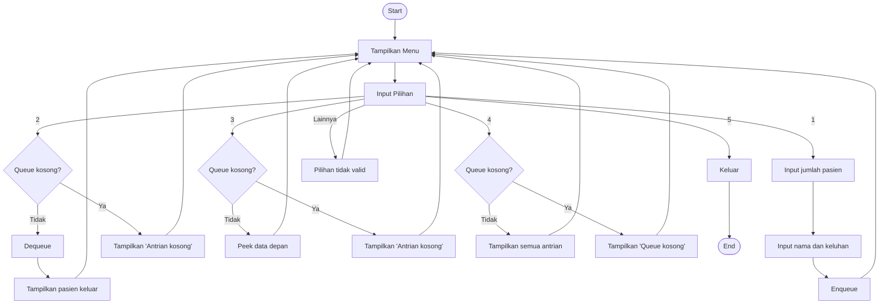

<h1><bold>Laporan Pengimplementasian LinkedList dan Queue di Sistem Antrian Rumah Sakit</bold></h1>

<h4>Nama</h4>
<ol>
  <li>Ryo Teguh Budi Utomo(2501010063)</li>
  <li>Ngakan Gede Marvyn Cakra Ajidharma(2501010078)</li>
  <li>Andi Pratama (2501010092)</li>
</ol>
 
<h2><bold>Rumusan Masalah dan Solusi</bold></h2> 
<h4>Rumusan Masalah</h4>

<ol>
  <li>Apa penyebab antrian di rumah sakit tidak efisien?</li>
  <li>Bagaimana cara membuat antrian rumah sakit lebih efisien?</li>
  <li>Apa konsep/teori yang perlu diimplementasikan?</li>
  <li>seberapa efisien sistem antrian dapat ditingkatkan?</li>
</ol>
<h4><bold>Solusi</bold></h4>
 
<h2><bold>Landasan Teori</bold></h2>

&nbsp;&nbsp;&nbsp;&nbsp;Menurut Susilo et al.(2025), Struktur data adalah proses menyimpan dan mengolah data yang sesuai dengan kebutuhan sistem dan dapat dilakukan secara efisien. contoh struktur data antara lain array, linked list,stack dan queue. Pemilihan struktur data yang tepat akan mempengaruhi tingkat efisiensi dalam suatu sistem. Yang akan digunakan dalam kasus ini adalah Queue dan LinkedList.

&nbsp;&nbsp;&nbsp;&nbsp;Queue atau antrean adalah struktur data untuk menyimpan berbagai elemen data dimana Queue menyusun elemen-elemen data secara linier (Saputra et al, 2026). Dalam kasus ini Queue dipilih karena konsepnya mengikuti prinsip FIFO(First in First Out) dimana pasien yang datang lebih awal akan dilayani lebih dulu dan tidak menunggu sangat lama.

&nbsp;&nbsp;&nbsp;&nbsp;FIFO adalah prinsip penyimpanan data yang mana data yang masuk paling awal akan menjadi data yang keluar paling awal juga dan penambahan data pada metode FIFO dilakukan pada simpul depan(Supriyono et al,2025). Pendapat dari ahli ini memperkuat pengambilan keputusan untuk menggunakan Queue dalam kasus ini. Selain itu, pada linked list, penambahan (enqueue) dan penghapusan (dequeue) dapat dilakukan tanpa perlu menggeser elemen lain, karena setiap data disimpan dalam node yang saling terhubung melalui pointer. Hal ini berbeda dengan array yang biasanya memerlukan pergeseran data saat elemen dihapus dari depan, sehingga kurang efisien

&nbsp;&nbsp;&nbsp;&nbsp;Implementasi queue menggunakan linked list dilakukan dengan memanfaatkan node yang saling terhubung untuk menyimpan data secara dinamis, di mana setiap node berisi data dan pointer ke node berikutnya. Dalam struktur ini digunakan dua penunjuk utama, yaitu front sebagai elemen terdepan dan rear sebagai elemen terakhir. Proses penambahan data (enqueue) dilakukan dengan menambahkan node baru di bagian belakang, sedangkan penghapusan data (dequeue) dilakukan dari bagian depan tanpa perlu menggeser elemen lain. Pada studi kasus antrian rumah sakit, pendekatan ini sangat sesuai karena jumlah pasien yang datang tidak dapat diprediksi, sehingga penggunaan linked list memungkinkan sistem menangani antrian secara fleksibel, efisien, dan terstruktur sesuai urutan kedatangan pasien.

 
<h2><bold>Desain Sistem dan Implementasi</bold></h2>

### Flowchart System 

Pada input,data dimasukkan ke dalam sistem, misalnya pasien memasukkan nama dan keluhan. Selanjutnya, pada tahap proses, sistem akan mengolah data tersebut sesuai aturan yang telah dibuat, seperti menambahkan pasien ke dalam antrian atau menentukan urutan pelayanan. Terakhir, tahap output adalah hasil dari proses tersebut, misalnya menampilkan daftar antrian, pasien yang dipanggil, atau informasi lainnya 

<h2><bold>Daftar Pusaka</bold></h2>
- Saputra, H., Arman, S. A., Fairuzabadi, M., Impron, A., Winardi, S., Lumba, E., Syah, F., Al Anshori, F., Saputra, N., Kadang, M. O., & Hastomo, W. (2026). *Struktur data dan algoritma dalam Python: Panduan praktis*. Yash Media. https://books.google.co.id/books?id=hJHCEQAAQBAJ  
- Supriyono, L. A., Carudin, C., Nugroho, H. A. S. A., Budiasto, J., Zulfa, I., & Kohsasih, K. L. (2025). *Buku ajar pengantar ilmu komputer*. Green Pustaka Indonesia. https://books.google.co.id/books?id=EqBxEQAAQBAJ  
- Susilo, D., Nistrina, K., & Hartati, S. (2025). *Buku ajar struktur data*. Sonpedia. https://books.google.co.id/books?id=ysWfEQAAQBAJ
