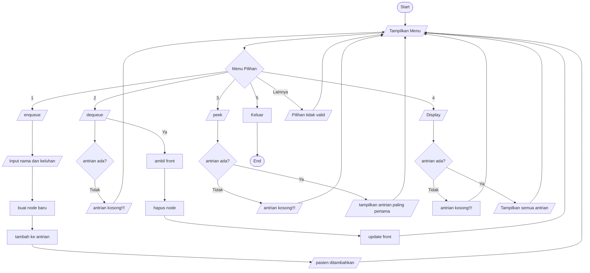

<h1><bold>Laporan Pengimplementasian LinkedList dan Queue di Sistem Antrian Rumah Sakit</bold></h1>

<h4>Nama|NIM|akun GitHub</h4>
<ol>
  <li>Ryo Teguh Budi Utomo |2501010063| ryoteguh</li>
  <li>Ngakan Gede Marvyn Cakra Ajidharma |2501010078| marpinleclerc-jpg</li>
  <li>Andi Pratama |2501010092| eyka0209akssjjs0209</li>
</ol>
 
<h2><bold>Rumusan Masalah dan Solusi</bold></h2> 
<h4>Rumusan Masalah</h4>

<ol>
  <li>Bagaimana struktur data queue berbasis linked list dapat diimplementasikan untuk mengelola antrian pasien di rumah sakit secara efisien dan terstruktur?</li>
  <li>Bagaimana penggunaan linked list sebagai dasar implementasi queue dapat meningkatkan fleksibilitas pengelolaan antrian dibandingkan implementasi berbasis array statis?</li>
  <li>Bagaimana sistem antrian yang dibangun mampu menyelesaikan permasalahan nyata dalam manajemen antrian pasien, khususnya dalam hal penambahan, pengeluaran, dan pemantauan antrian secara real-time?</li>
</ol>
<h4><bold>Solusi</bold></h4>

Untuk menyelesaikan permasalahan tersebut, dibuat program sistem parkir menggunakan bahasa pemrograman Python dengan menerapkan struktur data Queue berbasis Linked List. 
Adapun solusi yang diterapkan sebagai berikut: 

<ol>
  <li>Penggunaan linked list dinamis memungkinkan antrian bertumbuh dan menyusut sesuai kebutuhan tanpa batas kapasitas tetap, mengatasi keterbatasan array statis.</li>
  <li>Operasi enqueue (penambahan pasien) dan dequeue (pemanggilan pasien) mengikuti prinsip FIFO (First In, First Out), memastikan keadilan dalam penanganan pasien berdasarkan urutan kedatangan</li>    
  <li>Operasi peek memungkinkan petugas memantau pasien yang akan dilayani berikutnya tanpa mengganggu urutan antrian.</li>
  <li>Operasi display memberikan visibilitas penuh terhadap seluruh antrian yang sedang berjalan, memudahkan pengawasan dan manajemen oleh petugas rumah sakit.</li>
  <li>Menu interaktif berbasis terminal memungkinkan petugas mengelola antrian secara langsung dan intuitif.</li>
</ol>
 
<h2><bold>Landasan Teori</bold></h2>

&nbsp;&nbsp;&nbsp;&nbsp;Menurut Susilo et al.(2025), Struktur data adalah proses menyimpan dan mengolah data yang sesuai dengan kebutuhan sistem dan dapat dilakukan secara efisien. contoh struktur data antara lain array, linked list,stack dan queue. Pemilihan struktur data yang tepat akan mempengaruhi tingkat efisiensi dalam suatu sistem. Yang akan digunakan dalam kasus ini adalah Queue dan LinkedList.

&nbsp;&nbsp;&nbsp;&nbsp;Queue atau antrean adalah struktur data untuk menyimpan berbagai elemen data dimana Queue menyusun elemen-elemen data secara linier (Saputra et al, 2026). Dalam kasus ini Queue dipilih karena konsepnya mengikuti prinsip FIFO(First in First Out) dimana pasien yang datang lebih awal akan dilayani lebih dulu dan tidak menunggu sangat lama.

&nbsp;&nbsp;&nbsp;&nbsp;FIFO adalah prinsip penyimpanan data yang mana data yang masuk paling awal akan menjadi data yang keluar paling awal juga dan penambahan data pada metode FIFO dilakukan pada simpul depan(Supriyono et al,2025). Pendapat dari ahli ini memperkuat pengambilan keputusan untuk menggunakan Queue dalam kasus ini. Selain itu, pada linked list, penambahan (enqueue) dan penghapusan (dequeue) dapat dilakukan tanpa perlu menggeser elemen lain, karena setiap data disimpan dalam node yang saling terhubung melalui pointer. Hal ini berbeda dengan array yang biasanya memerlukan pergeseran data saat elemen dihapus dari depan, sehingga kurang efisien

&nbsp;&nbsp;&nbsp;&nbsp;Implementasi queue menggunakan linked list dilakukan dengan memanfaatkan node yang saling terhubung untuk menyimpan data secara dinamis, di mana setiap node berisi data dan pointer ke node berikutnya. Dalam struktur ini digunakan dua penunjuk utama, yaitu front sebagai elemen terdepan dan rear sebagai elemen terakhir. Proses penambahan data (enqueue) dilakukan dengan menambahkan node baru di bagian belakang, sedangkan penghapusan data (dequeue) dilakukan dari bagian depan tanpa perlu menggeser elemen lain. Pada studi kasus antrian rumah sakit, pendekatan ini sangat sesuai karena jumlah pasien yang datang tidak dapat diprediksi, sehingga penggunaan linked list memungkinkan sistem menangani antrian secara fleksibel, efisien, dan terstruktur sesuai urutan kedatangan pasien.

 
<h2><bold>Desain Sistem dan Implementasi</bold></h2>

### Flowchart System 

<h4> Implementasi sistem</h4>

 Implementasi sistem antrian pasien rumah sakit  dilakukan menggunakan bahasa pemrograman Python dengan menerapkan struktur data queue berbasis linked list. Program dibangun dalam bentuk class yang berfungsi untuk mengelola data pasien serta menyediakan operasi utama pada antrian.
Bentuk program bisa dilihat pada link berikut: 
https://github.com/ryoteguh/PROJECT-UTS-STRUKTUR-DATA.git

<h2><bold>Daftar Pusaka</bold></h2>
- Saputra, H., Arman, S. A., Fairuzabadi, M., Impron, A., Winardi, S., Lumba, E., Syah, F., Al Anshori, F., Saputra, N., Kadang, M. O., & Hastomo, W. (2026). *Struktur data dan algoritma dalam Python: Panduan praktis*. Yash Media. https://books.google.co.id/books?id=hJHCEQAAQBAJ  
- Supriyono, L. A., Carudin, C., Nugroho, H. A. S. A., Budiasto, J., Zulfa, I., & Kohsasih, K. L. (2025). *Buku ajar pengantar ilmu komputer*. Green Pustaka Indonesia. https://books.google.co.id/books?id=EqBxEQAAQBAJ  
- Susilo, D., Nistrina, K., & Hartati, S. (2025). *Buku ajar struktur data*. Sonpedia. https://books.google.co.id/books?id=ysWfEQAAQBAJ
